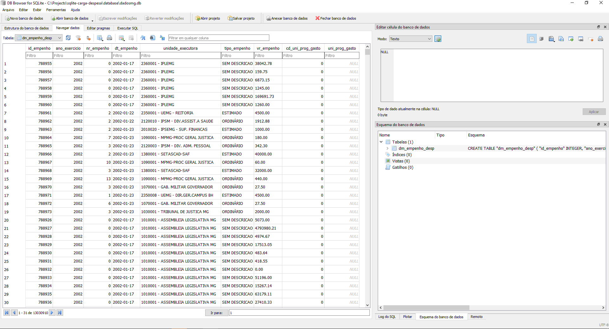

# SQLite - Carga Despesa do DadosMG


## Instruções de instalação e manipulações básicas do DuckDB no Windows


### Criar ambiente virtual do projeto
```python
cd diretorio/do/projeto
python -m venv venv
```

### Ativar ambiente virtual do projeto

Linha de comando (cmd) do Windows:
```python
venv\Scripts\activate
```

Git bash:
```python
source venv\Scripts\activate
```

### Criar arquivo de requerimentos
```python
touch requirements.txt
```

### Abrir o arquivo e inserir os seguintes requerimentos


	pandas==1.5.2
	db-sqlite3==3.41.2
	ckanapi==4.0

### Instala requerimentos
```python
pip install -r requirements.txt
```

### instala jupyter notebook
```python
pip install notebook
```

### Inicia o jupyter notebook
```python
jupyter notebook
```

### Execução no Jupyter Notebook
Baixar os arquivos csv.gz do portal [dadosmg](https://dados.mg.gov.br/dataset/despesa), salvá-los na pasta \datasets e extrair todos os arquivos csv. Após isso abrir o notebook 'dadosmg_basics.ipynb' no jupyter e executar.  

**NOTA**: Durante os testes realizados o kernel do Jupyter se mostrou instável, não conseguindo importar os dados corretamente e reiniciando durante o processo.

### Execução no Python
No git bash utilizar as diretivas do makefile.

Baixar arquivos tar.gz por portal dadosmg:  
```python
make download
```

Executar script de carga de dados.  
```python
make run
```

Fazer download dos arquivos e executa script de carga.
```python
make all
```


### Visualização de Dados

A ferramenta open source [DB Browser for SQLite](https://sqlitebrowser.org/) pode ser utilizada para visualizar a base de dados do SQLite.


